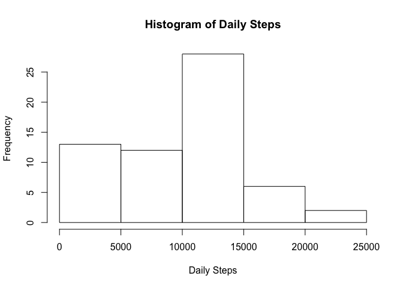
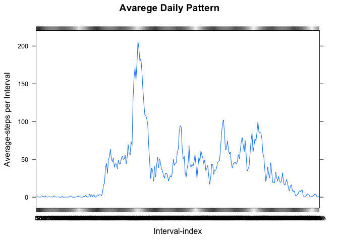
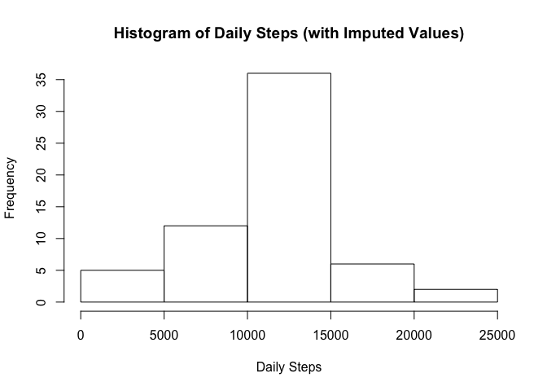
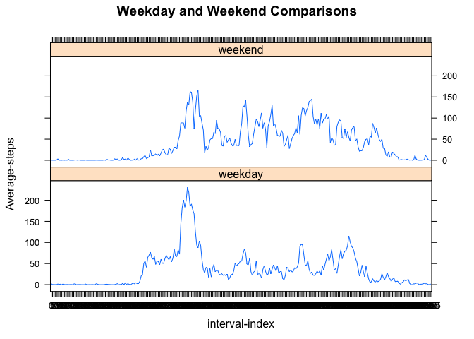

# Reproducible Research: Peer Assessment 1


## Loading and preprocessing the data

```r
library(ggplot2) 
library(dplyr)
```

```
## Warning: package 'dplyr' was built under R version 3.1.3
```

```
## 
## Attaching package: 'dplyr'
## 
## The following objects are masked from 'package:stats':
## 
##     filter, lag
## 
## The following objects are masked from 'package:base':
## 
##     intersect, setdiff, setequal, union
```

```r
library(lattice)
library(scales)
df1 = read.csv("activity.csv")
```
## Make them factors 

```r
df1[,"date"]=as.factor(df1[,"date"])
df1[,"interval"]=as.factor(df1[,"interval"])
```

## What is mean total number of steps taken per day?

```r
dailyStepTable = df1[,1:2] %>% group_by(date) %>%summarize(dailySteps = sum(steps,na.rm=TRUE))
hist(dailyStepTable$dailySteps,main = paste("Histogram of Daily Steps"),xlab="Daily Steps")
```

 

```r
meanDailySteps = mean(dailyStepTable$dailySteps)
medianDailySteps = median(dailyStepTable$dailySteps)
cat(sprintf("Mean Daily Steps: %.2f \nMedian Daily Steps: %.2f",meanDailySteps,medianDailySteps))
```

```
## Mean Daily Steps: 9354.23 
## Median Daily Steps: 10395.00
```

## What is the average daily activity pattern?

```r
intervalStepTable = df1[,c(1,3)] %>% group_by(interval) %>%summarize(intervalSteps = mean(steps,na.rm=TRUE))
xyplot(intervalStepTable$intervalSteps~intervalStepTable$interval, main="Avarege Daily Pattern", xlab="Interval-index",ylab="Average-steps per Interval",type="l")
```

 

### Find interval where the maximum is achieved

```r
intervalIndex = which(intervalStepTable$intervalSteps==max(intervalStepTable$intervalSteps))
cat(sprintf("index where maximum is achieved is %d",intervalIndex))
```

```
## index where maximum is achieved is 104
```


## Imputing missing values
I am replacing the median values (of steps) for a specific interval to replace NAs. I have tried average daily values but that replaced zeros with zersos. 


```r
naCols = which(is.na(df1$steps))

# replace them with meadian values for those intervals

df1$steps[naCols]=sapply(naCols,function(x) intervalStepTable$intervalSteps[which(intervalStepTable$interval==df1$interval[x])] )
dailyStepTableImpute = df1 %>% group_by(date) %>%summarize(dailySteps = sum(steps,na.rm=TRUE))
hist(dailyStepTableImpute$dailySteps,main = paste("Histogram of Daily Steps (with Imputed Values)"),xlab="Daily Steps")
```

 

```r
meanDailyStepsImpute = mean(dailyStepTableImpute$dailySteps)
medianDailyStepsImpute = median(dailyStepTableImpute$dailySteps)
cat(sprintf("Mean without imputing: %.2f Mean with imputing: %.2f: \nMedian without imputing: %.2f Median with imputing: %.2f",
            meanDailySteps,meanDailyStepsImpute,medianDailySteps,medianDailyStepsImpute))
```

```
## Mean without imputing: 9354.23 Mean with imputing: 10766.19: 
## Median without imputing: 10395.00 Median with imputing: 10766.19
```

## Are there differences in activity patterns between weekdays and weekends?

```r
df1[,"weeknd"]= sapply(weekdays(as.Date(df1$date)), function(x) if (x == "Sunday" || x == "Saturday") "weekend" else "weekday")
df1[,"weeknd"]=as.factor(df1[,"weeknd"])

summaryStats = df1 %>% group_by(weeknd,interval) %>%summarize(dailySteps = mean(steps,na.rm=TRUE))
scales=list(y=list(tick.number=10),x=list(tick.number=10))
xyplot(summaryStats$dailySteps~summaryStats$interval|summaryStats$weeknd,layout=c(1,2), main="Weekday and Weekend Comparisons",
       scales=list(y=list(seq(0,250,by=100)),
                   x=list(seq(1,2500,by=50))),
       xlab="interval-index",ylab="Average-steps",type="l")
```

 
       
